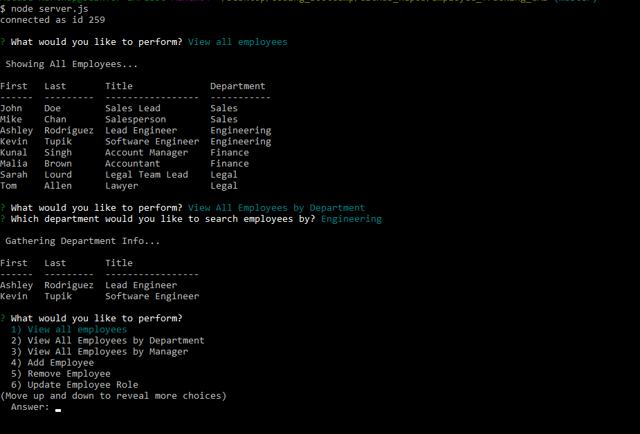

# Employee_Tracking_CMS

## Function 
- This Employee Tracking CLI app uses a MySQL server and communicates with the client through the Inquirer NPM. This application makes a CRUD (creating, read, update, and delete) functional app. The application allows you to enter new employees, update roles, delete employees, and view all current employees, managers, and departments.  
 
 

## Intended Use
- This application is created with the small to moderate sized company, looking for a light weight framework for their HR database. Easily update, view, and manage all employees from one command line application.

## List of links/dependencies
- mysql
- https://www.npmjs.com/package/inquirer
- inquirer
- https://www.npmjs.com/package/mysql 

Deployed URL
- 
